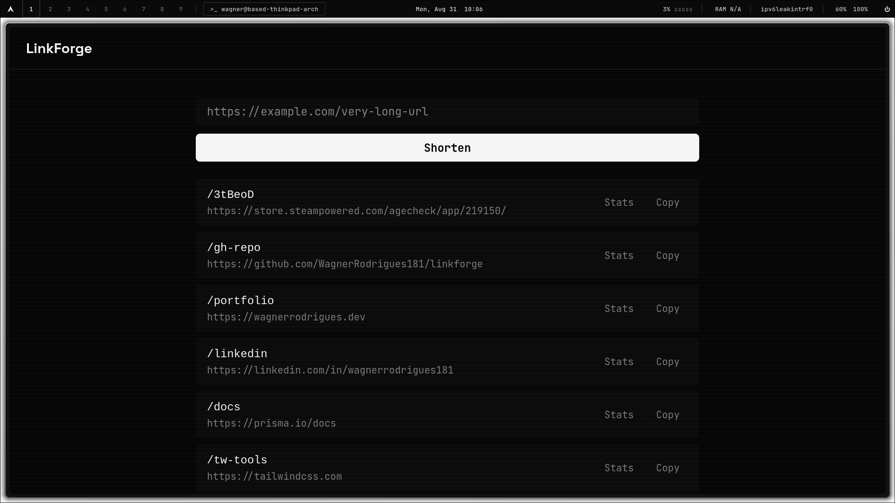
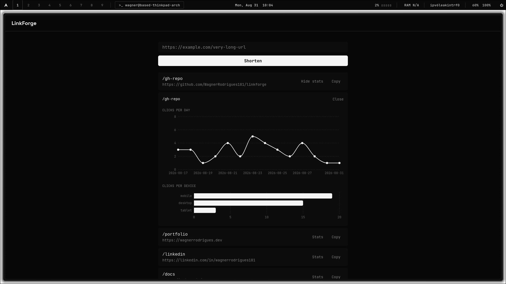

# LinkForge


URL shortener with Redis caching and a real-time analytics dashboard.

## Live Demo

- **App:** https://linkforge-five-roan.vercel.app
- **API:** https://linkforge-api-2imi.onrender.com

> The backend runs on Render's free tier, which spins down after periods of inactivity. The first request after idle time can take up to ~50 seconds to wake up; subsequent requests are fast.

## Stack

- Backend: Express + TypeScript + Prisma + PostgreSQL + Redis
- Frontend: React + Vite + TypeScript + Tailwind + Recharts
- Infra: Docker Compose + GitHub Actions
- Deploy: Vercel (frontend) + Render (backend + Postgres) + Upstash (Redis)

## Architecture Decision: Cache-Aside Redirect

The redirect route (`GET /:slug`) is the hottest path in the system. it can't hit Postgres on every single click. The flow:

1. Request comes in for a slug.
2. Check Redis first (`slug → targetUrl`).
3. **Cache hit:** redirect immediately, Postgres is never touched.
4. **Cache miss:** query Postgres, redirect, and populate Redis with a TTL, so the next click on that same link is served from cache.

Click events are recorded asynchronously (fire-and-forget) after the redirect response is sent, so analytics collection never adds latency to the user-facing redirect.

**Measured impact (local benchmark):**

| Scenario | Latency |
|---|---|
| Cache miss (cold start, first query after boot) | 218.97ms |
| Cache miss (warm connection) | 1.61ms – 7.62ms |
| Cache hit | 0.21ms – 0.71ms |

The cache also has a Postgres fallback: if Redis is unreachable, the redirect route degrades gracefully to querying Postgres directly instead of failing the request.

### Aggregation: SQL over JavaScript

The analytics endpoints (`clicks-per-day`, `clicks-per-device`) aggregate data at the database level instead of pulling raw rows into Node and reducing them in memory. Benchmarked against 20,000 synthetic click records:

| Approach | Latency (20k clicks) |
|---|---|
| Aggregate in JavaScript (fetch all rows, reduce in Node) | 57ms – 116ms |
| Aggregate via SQL `GROUP BY` (Postgres aggregates, returns pre-computed) | 13ms – 34ms |

`clicks-per-device` uses Prisma's native `groupBy`. `clicks-per-day` uses a raw SQL query (`$queryRaw`) instead, because Prisma's `groupBy` can't truncate a `DateTime` down to just the date; it would group by exact timestamp instead, which is effectively useless for a daily chart.

## Styling Decision: CRT Phosphor

The interface uses a monochromatic, high-contrast palette (near-black background, pure white accents, no color hue) styled after old CRT terminals, paired with `Space Grotesk` for headings and `JetBrains Mono` for body/code, plus a subtle scanline overlay across the app shell.

This wasn't the first direction: an earlier iteration used a "Slate Blue + Teal" palette. After comparing it side-by-side with five alternatives, CRT Phosphor was chosen instead: it leans on typography and grid discipline rather than a themed color effect, which reads as more deliberate for a portfolio piece.

## Running locally

Prerequisite: Docker and Docker Compose installed.

```bash
docker compose up --build
```

This brings up 4 services:

| Service | Port | URL |
|---|---|---|
| Client (Vite) | 5173 | http://localhost:5173 |
| Server (Express) | 3000 | http://localhost:3000 |
| Postgres | 5432 | — |
| Redis | 6379 | — |

Backend health check: `curl http://localhost:3000/health`

Hot reload is enabled for both client and server via bind mounts; code changes are reflected without a rebuild.

## Screenshots

| Shorten a link | Analytics dashboard |
|---|---|
|  |  |

## Status

Live - deployed to production.